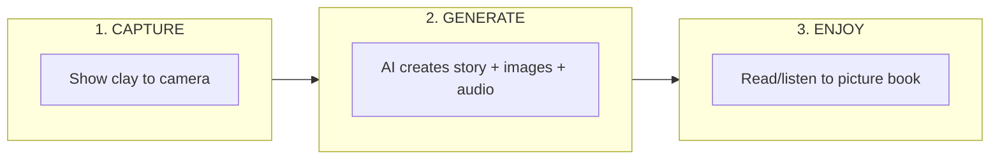
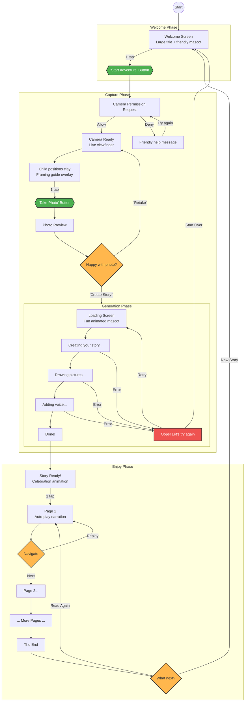
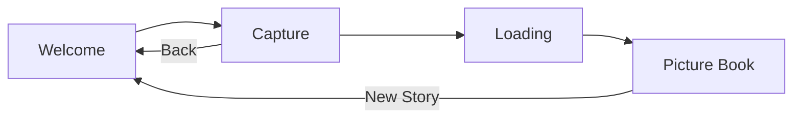
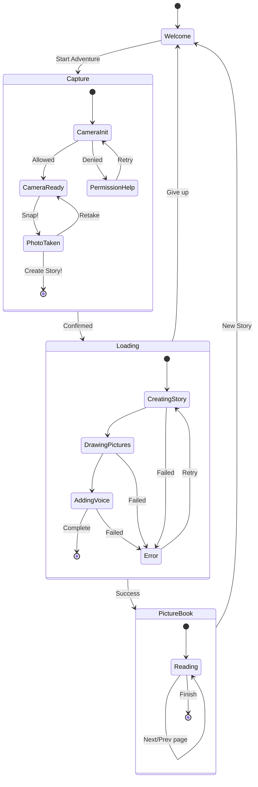

# ClayQuest: The Autonomous World-Builder

## Product Requirements Document - MVP

---

## 1. Overview

**Product Name:** ClayQuest
**Tagline:** Transform clay creations into magical audio picture books
**Hackathon:** Agentic Orchestration Hack (January 16, 2026)

### 1.1 Problem Statement

Children love creating with clay, but their creations remain static physical objects. There's no easy way to bring these creations to life digitally and create memorable, shareable stories from them.

### 1.2 Solution

ClayQuest is a web application that allows children to photograph their clay creations and automatically generate an illustrated audio picture book featuring their characters. The AI analyzes the clay figures and creates an imaginative story around them.

### 1.3 Target Users

- Children ages 4-12
- Parents/guardians facilitating creative play
- Educators in art/creative classrooms

### 1.4 Core Value Proposition

**One photo → One magical story book**

The simplest possible interaction: child shows their clay creation, AI does the rest.

---

## 2. Core User Flow

### 2.1 MVP Flow (Simplified)

**MVP Philosophy:** Minimize input, maximize magic. One photo is all we need.

### 2.2 Detailed User Flow

### 2.3 Interaction Analysis

| Phase | User Actions | Wait Time | Design Goal |
|-------|-------------|-----------|-------------|
| Welcome | 1 tap | 0s | Immediate engagement |
| Capture | 1-2 taps | 0s | Simple, forgiving |
| Generate | 0 taps | 30-60s | Entertaining wait |
| Enjoy | Swipe/tap | 0s | Immersive experience |

**Total: 3-4 taps to create a story**

### 2.4 Why No Voice Input for MVP?

| Consideration | Decision |
|--------------|----------|
| Simplicity | Fewer steps = less friction for young children |
| Speed | Faster to complete the flow |
| Technical | One less API integration to debug |
| Fallback | Can add voice input in v1.1 if stories need more context |

The AI should be creative enough to build an engaging story from visual input alone. If the output quality is insufficient, we add voice input as an enhancement.

---

## 3. Screen Specifications

### 3.1 Screen Flow

### 3.2 Screen State Diagram

### 3.3 Screen Details

#### Screen 1: Welcome Screen

**Purpose:** First impression, set the tone, invite to play

| Element | Specification |
|---------|--------------|
| Title | "ClayQuest" - large, playful font |
| Subtitle | "Turn your clay into stories!" |
| CTA Button | "Start Adventure" - oversized, animated |
| Visual | Friendly mascot character |
| Background | Warm, inviting colors |

**Interaction:**
- Single tap on button → Camera screen
- No other actions needed

---

#### Screen 2: Capture Screen

**Purpose:** Take a clear photo of clay creation

| Element | Specification |
|---------|--------------|
| Viewfinder | Full-screen camera feed |
| Frame Guide | Soft overlay showing optimal placement |
| Capture Button | Large shutter icon at bottom center |
| Back Button | Top-left corner (subtle) |
| Instructions | "Show me your clay!" - friendly text |

**Interaction:**
- Position clay within frame guide
- Tap shutter → Photo taken
- Preview appears with Retake / Create Story options

**Photo Preview Overlay:**
- Captured image displayed
- "Retake" button (secondary)
- "Create My Story!" button (primary, prominent)

---

#### Screen 3: Loading Screen

**Purpose:** Make the wait enjoyable, build anticipation

| Element | Specification |
|---------|--------------|
| Animation | Playful mascot doing magic/creating |
| Progress | Visual progress (not percentage) |
| Status Text | Rotating messages (see below) |
| Background | Matching app theme |

**Status Messages (cycle through):**
1. "Reading your creation..."
2. "Imagining a story..."
3. "Drawing pictures..."
4. "Adding a storyteller voice..."
5. "Almost ready..."

**Error State:**
- Friendly message: "Oops! The magic got stuck. Let's try again!"
- "Try Again" button
- "Start Over" link

---

#### Screen 4: Picture Book View

**Purpose:** Immersive story experience

| Element | Specification |
|---------|--------------|
| Image | Full-screen illustrated scene |
| Audio | Auto-play narration for each page |
| Navigation | Swipe left/right or arrow buttons |
| Progress | Page dots at bottom |
| Controls | Play/pause audio button |
| Exit | "New Story" button (appears on last page) |

**Page Structure:**
- Large illustration (80% of screen)
- Narration text below (optional display)
- Audio plays automatically on page enter

**Last Page:**
- "The End" title
- "Read Again" button
- "New Story" button

---

### 3.4 Design System

#### Color Palette

| Role | Color | Usage |
|------|-------|-------|
| Primary | Warm Orange (#FF9800) | Buttons, highlights |
| Secondary | Sky Blue (#03A9F4) | Accents, links |
| Background | Cream (#FFF8E1) | Page backgrounds |
| Text | Dark Brown (#4E342E) | Body text |
| Success | Green (#4CAF50) | Confirmations |
| Error | Soft Red (#EF5350) | Error states |

#### Typography

| Element | Font Style | Size |
|---------|-----------|------|
| Title | Rounded, bold | 48px+ |
| Subtitle | Rounded, medium | 24px |
| Body | Clean, readable | 18px |
| Button | Bold, uppercase | 20px |

#### Interaction Guidelines

| Principle | Implementation |
|-----------|---------------|
| Large touch targets | Min 60px tap area |
| Immediate feedback | Button press animations |
| Forgiving design | Easy to undo/retry |
| No dead ends | Always a way forward or back |
| Celebration | Success animations, sounds |

---

## 4. MVP Features

### 4.1 Must Have (P0)

| Feature | Description |
|---------|-------------|
| Camera Capture | Take photo via webcam |
| Photo Preview | Review before proceeding |
| Story Generation | AI creates 3-5 page story from photo |
| Image Generation | AI illustrates each page |
| Audio Narration | AI voice reads each page |
| Picture Book Viewer | Navigate through story |

### 4.2 Explicitly NOT in MVP

| Feature | Reason | Future Version |
|---------|--------|----------------|
| Voice Description | Simplify flow first | v1.1 |
| Save/Share Stories | Focus on core magic | v1.1 |
| Multiple Characters | Complexity | v1.2 |
| Character Memory | Requires persistence | v2.0 |
| User Accounts | Not needed for demo | v2.0 |

---

## 5. Success Criteria

### 5.1 Demo Flow Checklist

- [ ] Child shows clay to camera
- [ ] One tap to capture photo
- [ ] One tap to start story creation
- [ ] Loading screen entertains during wait
- [ ] 3-5 page story is generated
- [ ] Each page has unique illustration
- [ ] Audio narration plays automatically
- [ ] Easy page navigation
- [ ] Can start new story at the end

### 5.2 User Experience Goals

| Metric | Target |
|--------|--------|
| Taps to first story | ≤ 4 |
| Generation time | < 60 seconds |
| Story relevance | Characters match clay |
| Child engagement | Watches entire story |
| Repeat usage | Wants to make another |

### 5.3 Quality Bar

**Story Quality:**
- Story features the clay creation as main character
- Age-appropriate content and vocabulary
- Has beginning, middle, end structure
- Engaging and imaginative

**Image Quality:**
- Illustrations match story narrative
- Consistent art style across pages
- Child-friendly aesthetic

**Audio Quality:**
- Clear, warm narration voice
- Appropriate pacing for children
- Matches text on screen

---

## 6. Risks & Mitigations

| Risk | Impact | Mitigation |
|------|--------|------------|
| AI misinterprets clay | High | Provide clear framing guide, good lighting tips |
| Story not engaging | Medium | Tune prompts, add voice input in v1.1 |
| Long generation time | Medium | Engaging loading animations |
| API failures | High | Retry logic, friendly error messages |
| Child loses interest waiting | Medium | Entertaining loading screen |

---

## 7. Open Questions

1. **Story length:** 3 pages vs 5 pages? Shorter = faster, longer = more value
2. **Art style:** Should match clay aesthetic or be more polished illustration?
3. **Narration voice:** Which voice personality works best for kids?
4. **Retry flow:** If child doesn't like story, can they regenerate with same photo?

---

## 8. Future Enhancements (Post-MVP)

| Version | Features |
|---------|----------|
| v1.1 | Voice description input (optional), Save stories |
| v1.2 | Multiple clay characters, Share to family |
| v2.0 | Character memory, Story continuation, Parent dashboard |

---

*Document Version: 2.0 MVP*
*Last Updated: January 16, 2026*
*Focus: Product design and user experience*
*Technical details: See TECHNICAL.md (to be created)*
